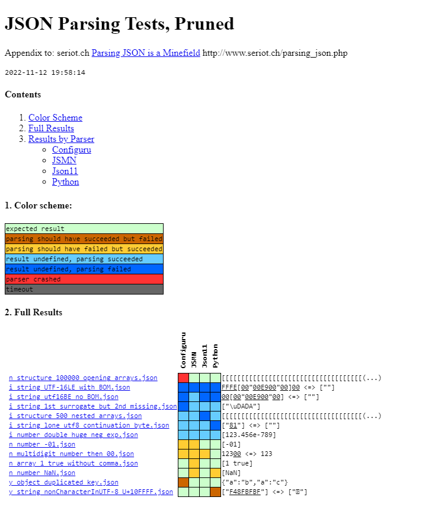

# JSON Parsing Test Suite \[FORK\]

This is a fork of the JSONTestSuite, which is a tool for testing JSON parsers. See the original README for more information [here](https://github.com/nst/JSONTestSuite).

## Why fork?

In order to make it easier to run the tests and see the results:
- Drastically reduce the number of parsers tested to only the ones I care about.
- Make some improvements to the test runner.

## How to run

```bash
python run_tests.py
```

## Results

The script writes logs in `results/logs.txt`.

The script then reads `logs.txt` and generates `results/parsing.html`.


